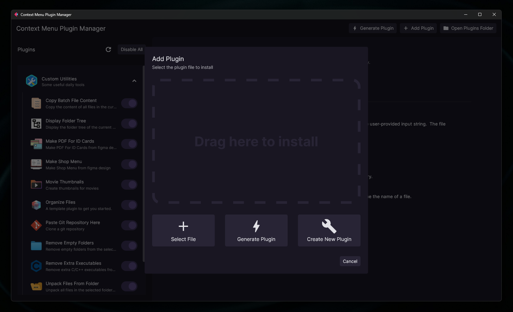

# Context Menu Plugin Manager




This project manages context menu plugins to extend functionality in various directories. It allows dynamic addition and removal of context menu items using Python scripts.

## Features

- **Plugin Development:** Easily create plugins with metadata and functionality.
- **Dynamic Menu Modification:** Add or remove context menu items on the fly.
- **Extensible:** Customize and extend functionality by creating new plugins.

## Installation

First make sure you have Python 3.13.1 or above installed. If not, you can download it from [here](https://www.python.org/downloads/).

1. Clone the repository:

   ```
   git clone https://github.com/abdbbdii/Context-Menu-Plugin-Manager.git
   ```

2. Go inside the repository:

   ```
   cd Context-Menu-Plugin-Manager
   ```

3. Create a virtual environment

   ```
   python -m venv .venv
   ```

4. Activate the virtual environment

   ```
    .venv\Scripts\activate
   ```

5. Install the requirements

   ```
   pip install -r requirements.txt
   ```

6. Run the program

   ```
   python app.py
   ```

## Creating a Plugin

This is a template plugin to help you get started with creating your own plugins.

## Usage

The `driver` function receives two arguments:

- `items`: A list of strings representing the selected folders/files.
- `params`: A JSON string containing the configuration parameters.

You can access the configuration parameters in the 'Configure Plugin' tab.

## Example

```python
# Import the JSON module to work with JSON data
import json

"""
It receives a list of items and a JSON string as parameters.
It prints the items and the parameters to the console.
The `__name__ == "__main__"` block is for testing purposes only.
The `driver` function is the entry point for the Python script.
"""


# Only this line of code is required to create a plugin
def driver(items: list[str] = [], params: str = ""):

    # Convert JSON string to dictionary
    json_data = json.loads(params) if params else {}

    print("Folders/Files:")
    for item in items:
        print(item)

    print("Params:")
    for key, value in json_data.items():
        print(f"{key}: {value}")

    # Keep the console open by waiting for user input
    input("Press Enter to exit")


# For testing in the local directory (not executed when triggered as a plugin)
if __name__ == "__main__":
    json_data: dict = {
        "param1": "value1",
        "param2": "value2",
    }

    string_data: str = json.dumps(json_data)

    driver(["file1.txt", "file2.txt"], string_data)
```

## License

This project is licensed under the [BSD License](https://github.com/abdbbdii/context-menu-plugin-manager/blob/main/LICENSE).

## Contributing

Contributions are welcome! Feel free to open issues or submit pull requests to improve this project.

## Credits

Big thanks to these awesome creators!

- [@Flet Dev Community](https://github.com/flet-dev) for the [`flet`](https://flet.dev/) - A framework based on flutter for creating desktop applications.
- [@saleguas](https://github.com/saleguas) for the [`context-menu`](https://github.com/saleguas/context_menu) - A library to customize the context menu.
- [@Wanna-Pizza](https://github.com/Wanna-Pizza) for the [`FletDropZone`](https://github.com/Wanna-Pizza/FletDropZone) - A drag and drop feature for `flet`.
